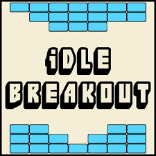
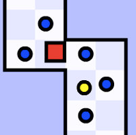

<a href="https://docs.google.com/forms/d/166z5qJcBGLJGZQ_v3olCz8s-C4r2IBdPoQEWw3nuXFU/viewform?edit_requested=true"> Reqeust A Game </a>
  
  <head>
    <link rel="shortcut icon" type="image/png" href="favicon.ico">
  </head>

